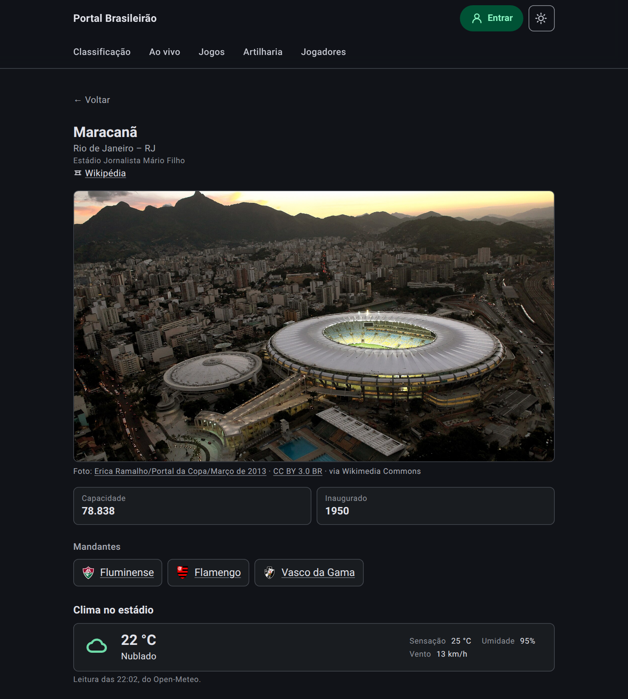

# Portal Brasileirão

[](https://github.com/mpbarbosa/portal_brasileirao/actions/workflows/ci.yml)

Companion app for the Brazilian football championship — live match detail, standings, and
club data for the Campeonato Brasileiro Série A.

**React 19 · TypeScript · Express · AWS.** Built end-to-end by directing the AI coding
agent Claude Code.

> **Live:** https://brasileirao.mpbarbosa.com — a t3.micro in sa-east-1 running the bundle as a
> systemd service behind nginx, on a static Elastic IP, with an auto-renewing Let's
> Encrypt certificate.
>
> Live Série A data comes from [football-data.org](https://www.football-data.org) when
> `FOOTBALL_DATA_TOKEN` is set; without a token the app serves a frozen snapshot, so a
> fresh clone runs with no signup.

![Classificação do Campeonato Brasileiro Série A no tema claro: no alto, à direita, o botão Entrar, ao lado do que alterna entre o tema claro e o escuro. Numa linha própria sob ele, as secções Classificação, Ao vivo, Jogos, Artilharia e Jogadores, a atual sublinhada. Acima da tabela, à esquerda, um seletor de três posições — Completa, Casa e Fora, com Completa marcada; à direita, dois botões: um mostra a forma na coluna da campanha, o outro oferece ver a campanha em barras em vez da linha. Abaixo, os 20 clubes com escudo, pontos, o gráfico da campanha, jogos, vitórias, empates, derrotas, saldo de gols e o aproveitamento em percentagem; a posição do líder vem num círculo cheio, e só a dele. À esquerda de cada posição, uma faixa diz o que aquela posição vale: verde contínua nos quatro primeiros, verde tracejada no quinto, azul-escura do sexto ao décimo primeiro e vermelha nos quatro últimos, com o meio da tabela sem faixa nenhuma. Logo abaixo, uma legenda de quatro linhas diz o que cada faixa significa: G4 Libertadores, as quatro primeiras posições; G5 Pré-Libertadores, a quinta posição; G11 Sul-Americana, da sexta à décima primeira posição; e Z4 Rebaixamento, as quatro últimas. Sob a legenda, o painel Números da temporada: em três cartões, os gols do campeonato e em quantos jogos, os gols por jogo e a percentagem de vitórias do mandante; e ao lado um do outro, os melhores ataques e as melhores defesas, três clubes em cada, com escudo, nome e o número de gols. Ao pé da página, o rodapé diz que o projeto é independente e sem vínculo com a CBF ou com os clubes, traz duas ligações para os outros sites do autor — mpbarbosa.com e copa2026.mpbarbosa.com — e a saúde do serviço: estado, fonte dos dados, versão, quando foi compilado e desde quando está no ar.](docs/screenshots/classificacao-light.png)


*Classificação, light and dark. The app follows your system setting and remembers an explicit
choice; the control in the header switches between them. **Campanha** is the club's position
after each round — the season behind a single row.*

 

*On a phone the five sections move to a navigation bar fixed at the bottom, icon above label,
the current one marked by a pill. Above `sm` they stay inline in the header — which is why the
desktop shots above look no different. Five is Material Design 3's ceiling for this pattern, and
the bar is now at it: the labels fit at 375dp because the items carry no horizontal padding, and
below 360dp the active indicator narrows rather than let the last destination fall off the edge.*

![Página Ao vivo no tema claro, numa noite de domingo: a secção Agora traz dois cartões da 25ª rodada — Corinthians 0 × 0 Santos e Flamengo 0 × 0 Botafogo — cada um com escudos, a rodada, a etiqueta "Bola rolando" ao lado de um ponto verde, uma ligação Ver a partida e as marcas das emissoras, e ao pé a nota de que os placares são atualizados automaticamente enquanto a página estiver aberta. Abaixo, a secção A seguir lista quatro jogos por vir — Clube do Remo × Coritiba, Flamengo × Mirassol, Bragantino × Bahia e São Paulo × Atlético-MG — cada um com a data, o horário, a contagem regressiva e a etiqueta A realizar.](docs/screenshots/ao-vivo-light.png)


*Ao vivo, light and dark — what is being played now, what is next, and what just finished.
Matches in progress get a card each rather than a row, so simultaneous kickoffs are all
visible at once — the shots above caught one being played, which earlier sets never did.
Between rounds "Agora" answers in a sentence rather than vanishing, which is the more common
state and the reason it is written as a sentence at all. It is the only page that
refetches on its own. There is deliberately no match minute: the provider reports a status
and a score and never an elapsed clock, so the page says **bola rolando** rather than
guessing a number.*

![Página do clube Palmeiras no tema claro: escudo, o técnico Abel Ferreira, o endereço da sede, site oficial, perfil no Instagram, hino do clube e artigo na Wikipédia; à direita, o botão Seguir, que marca o clube como o time do leitor; os números da temporada (1º lugar, 52 pontos, 25 jogos, saldo +24 e 69% de aproveitamento); ao lado do título Campanha, um botão oferece vê-la em barras em vez da linha, e abaixo o gráfico da campanha do 11º lugar na 1ª rodada ao 1º na 25ª, os últimos cinco resultados, o próximo jogo — Mirassol × Palmeiras, domingo 30/08 às 18:30, marcado como A realizar e com a marca do Prime Video — e os artilheiros do clube, José Manuel López com 8 gols e Mauricio com 7.](docs/screenshots/clube-palmeiras-light.png)


*Jogos, light and dark. Every round of the season is reachable from the picker, and each
fixture carries the broadcasters showing it — ge, Globo, Premiere, SporTV, Cazé TV, YouTube
and Prime Video, with anyone we have no mark for rendered as their own name.*


*Jogadores, light and dark — the elenco of all twenty clubs. The panels are native `<details>`,
closed on arrival: the division fields close to a thousand players, and rendered flat the second
club would begin twenty screens below the first, which is exactly the by-club structure the page
exists to show. Two clubs can be open at once, which a picker would not allow. Positions arrive
from the provider at two levels of detail in the same list — a broad line for most players, a
specific role for a few — so they are folded onto the line they belong to, and a player's own
position is printed under the name only when it says something the heading did not.*

![Página da partida Palmeiras 4 x 1 Vasco da Gama no tema claro: a 24ª rodada à esquerda e a etiqueta Encerrado à direita; placar com escudos e, sob o nome de cada clube, uma ligação para o seu artigo na Wikipédia; sob uma linha divisória, quem marcou de cada lado e em que minuto — Lopez aos 46', Vitor Roque de pênalti aos 50', Mauricio aos 55' e Lopez aos 89' pelo Palmeiras, Facundo aos 90+3' pelo Vasco; a data e a hora; o estádio, com um alfinete ao lado do nome "Nubank Parque", que liga à página do próprio estádio, e a cidade e o estado em texto simples; as emissoras que transmitiram; uma secção Escalações recolhida, que se abre para os dois onzes; e, abaixo, a Campanha dos dois clubes, com um botão que a troca de linha para barras.](docs/screenshots/partida-554977-light.png)


*A match page, light and dark. **Gols** names who scored and for which club, from CBF's own
match feed — the club a goal *counts for* rather than the scorer's club, which is the whole of
what puts an own goal on the right side of a scoreboard. It is also what pushed the campanha
and the melhores momentos below this capture's crop — and goal coverage has since reached the
second fixture too, so that page's own Gols band has now evicted its melhores momentos in the
same way. The campanhas are the only one of the two any capture still shows.
Both clubs' campanhas are stacked rather than overlaid, so
they share one scale and their rounds line up — the app has no series palette, and inventing
a hue pair would be the only place colour carried meaning no token defines. **Melhores
momentos** links each broadcaster's own package; where none is curated it falls back to a
YouTube search and says so.*

![Página da partida Botafogo 1 x 1 Fluminense no tema claro: a 22ª rodada à esquerda e a etiqueta Encerrado à direita; o placar com os escudos dos dois clubes e, sob o nome de cada um, uma ligação para o seu artigo na Wikipédia; sob uma linha divisória, quem marcou de cada lado — Alex Telles, de falta, pelo Botafogo, e Ignacio pelo Fluminense; a data e a hora do jogo; o estádio, com um alfinete ao lado do nome "Nilton Santos", que liga à página do próprio estádio, e a cidade e o estado; a linha do árbitro, que nomeia Bruno Arleu de Araujo; e as emissoras que transmitiram. Esta partida não tem minutos registados, por isso os marcadores aparecem sem eles. As campanhas dos dois clubes ficam abaixo do que cabe no enquadramento.](docs/screenshots/partida-554951-light.png)


*A second match page, and the only capture that shows the **Árbitro** line. It is here rather
than in place of the one above because no single fixture can carry both: upstream names an
official for 157 of the season's 380 fixtures, while the stadium and the broadcaster marks come
from data curated forward for coming rounds — 30 fixtures — and the two sets do not share a
single round. So the Palmeiras page documents the estádio and the emissoras, and this one
documents the árbitro. Where upstream names nobody the line is absent rather than blank, which
is the common case at 223 of 380.*

*A club page, in both themes. **Campanha** traces where the club sat after every round, and
the marks under each fixture say which broadcaster showed it. The marks keep a light backing
in both themes on purpose — Globo's circle and the Premiere wordmark are dark artwork on a
transparent ground, and they vanish against a dark page without it.*

![Página do estádio Maracanã no tema claro: o nome popular em destaque, "Rio de Janeiro – RJ" abaixo, o nome oficial "Estádio Jornalista Mário Filho" e uma ligação para o artigo na Wikipédia; uma fotografia aérea do estádio ao entardecer, iluminado, com a cidade e os morros do Rio ao fundo, e logo abaixo a linha de crédito com o nome do fotógrafo e a licença; dois números lado a lado — capacidade de 78.838 e inaugurado em 1950; os mandantes Fluminense, Flamengo e Vasco da Gama, cada um com escudo e ligação para a sua página; e o clima no estádio, com um ícone de nuvem, 22 °C, “Nublado”, a sensação, a umidade e o vento ao lado, e sob o cartão a hora da leitura e a fonte, o Open-Meteo.](docs/screenshots/estadio-maracana-light.png)



*A stadium page, light and dark, reached from a match's **Estádio** line — it has no nav
entry, because a ground is somewhere you arrive at from a fixture rather than a section
you set out to browse. No feed we read has a stadium in it:
football-data carries no venue field at any tier, and CBF reports only `Stadium - City - UF`
per match, so the roster is derived by grouping fixtures on the slug of that string. That
slug is the identity, which is what makes CBF's `ARENA MRV` and `Arena MRV` one ground
rather than two. **Mandantes** falls out of who actually hosted there — nobody had to say
the Maracanã has two tenants. Capacity, the official name and the year are hand-curated, and
each is left out rather than guessed where the source is silent. So is the
**photograph**, which no feed carries either — it is named by its file title on
Wikimedia Commons and fetched from there, and it always ships with the photographer
and the licence, because every licence in use but one requires the credit wherever
the picture appears.*

## Stack

| Layer | Choice |
| --- | --- |
| UI | React 19 + TypeScript, Vite dev server and build |
| Styling | Tailwind CSS |
| API / SSR host | Express (TypeScript, bundled with esbuild for production) |
| Data | [football-data.org](https://www.football-data.org) v4, competition `BSA` |
| Hosting | AWS |
| Tests | `node --test` for unit logic, Playwright for end-to-end |

The Express server owns the data-sync layer (fetching and normalizing match, table, and
club data) and serves the built React bundle, so development and production run the same
single process.

## Local setup

1. Install dependencies:

```sh
npm install
```

2. Copy `.env.example` to `.env`. For live data, register a free token at
   [football-data.org](https://www.football-data.org/client/register) and set
   `FOOTBALL_DATA_TOKEN`. Skip it to run on seed fixtures.

3. Start the development server:

```sh
npm run dev
```

The dev server listens on port `3000`, or the next free port if `3000` is taken.

## Commands

- `npm run dev` — start the Express + Vite development server
- `npm run build` — build the frontend and bundle the server
- `npm start` — run the production build
- `npm run lint` — type-check with TypeScript
- `npm run test:unit` — run the Node unit test suite
- `npm run test:e2e` — run the Playwright end-to-end suite (boots its own server)
- `npm run clean` — remove `dist`
- `npx tsx scripts/sync-seed-data.ts` — regenerate the offline seed data from the live API
- `npm run screenshot [url] [light|dark]` — refresh the README screenshot from the live site
- `npm run deploy:preflight` — build and verify the production payload locally
- `DEPLOY_HOST=ubuntu@host npm run deploy` — deploy to EC2 (see `scripts/README.md`)

Run a single test file with `node --import tsx --test tests/standings-core.test.ts`.

## Layout

```
src/                    React application, shared types, seed data
standings-core.ts       pure table computation (no I/O)
matches-core.ts         pure round filtering and feed ordering (no I/O)
football-data-core.ts   pure football-data.org adapter: URLs + response mapping
cache-core.ts           TTL cache and circuit breaker
server.ts               Express host: API routes, Vite in dev, static serving in prod
tests/                  unit tests for the core modules
```

Calculation logic lives in root-level `*-core.ts` modules that do no I/O, so it can be
unit-tested without mocking HTTP. `server.ts` does any fetching and passes payloads in.

## API

Every data endpoint returns `{ source, note, updatedAt, data }`, where `source` is one of:

- `football-data` — live upstream data
- `placeholder` — seed fixtures, because no token is configured
- `fallback` — seed fixtures, because the upstream failed or was disabled

The UI banners the `note` for anything that isn't live. The free tier allows 10
requests/minute; standings cache for 60s and fixtures for 60s (15s while a match is live),
so the app makes at most ~5 upstream calls/minute no matter how much traffic it serves. A
circuit breaker opens after 3 consecutive failures and stays open for 60s.

- `GET /api/health` — status, version, uptime
- `GET /api/clubs` — the 20 Série A clubs
- `GET /api/standings` — the computed table
- `GET /api/matches[?round=N]` — fixtures, defaulting to the whole feed

## Working with Claude Code

This repository is developed by directing Claude Code rather than by hand.
[CLAUDE.md](CLAUDE.md) carries the architecture and conventions;
[CONTEXT.md](CONTEXT.md) is the domain glossary — what each Portuguese term means in
this codebase, and which near-synonyms were rejected and why. Read both before changing
behaviour, and update them in the same commit when a convention or a term changes.

## License

MIT — see [LICENSE](LICENSE).
