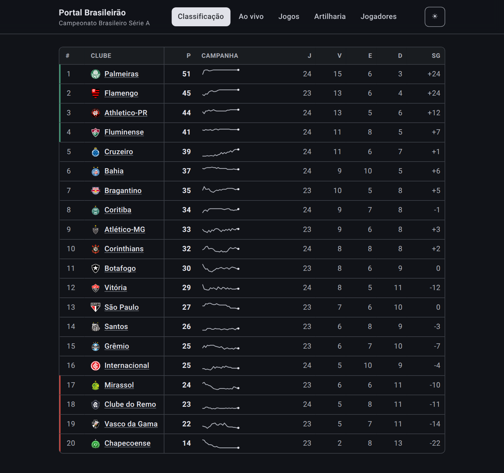
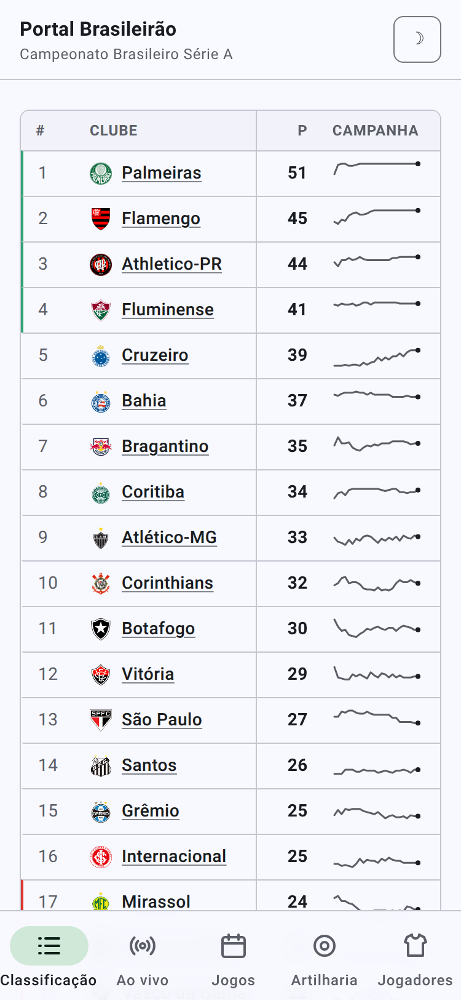
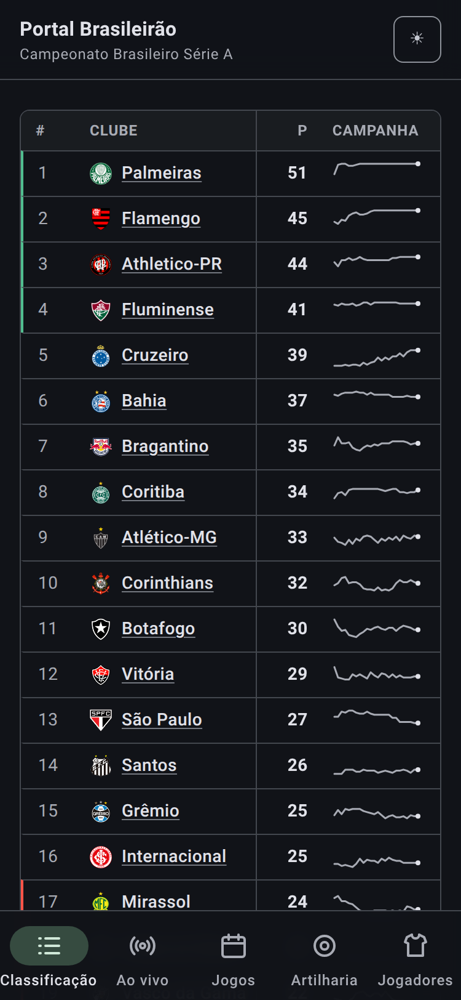
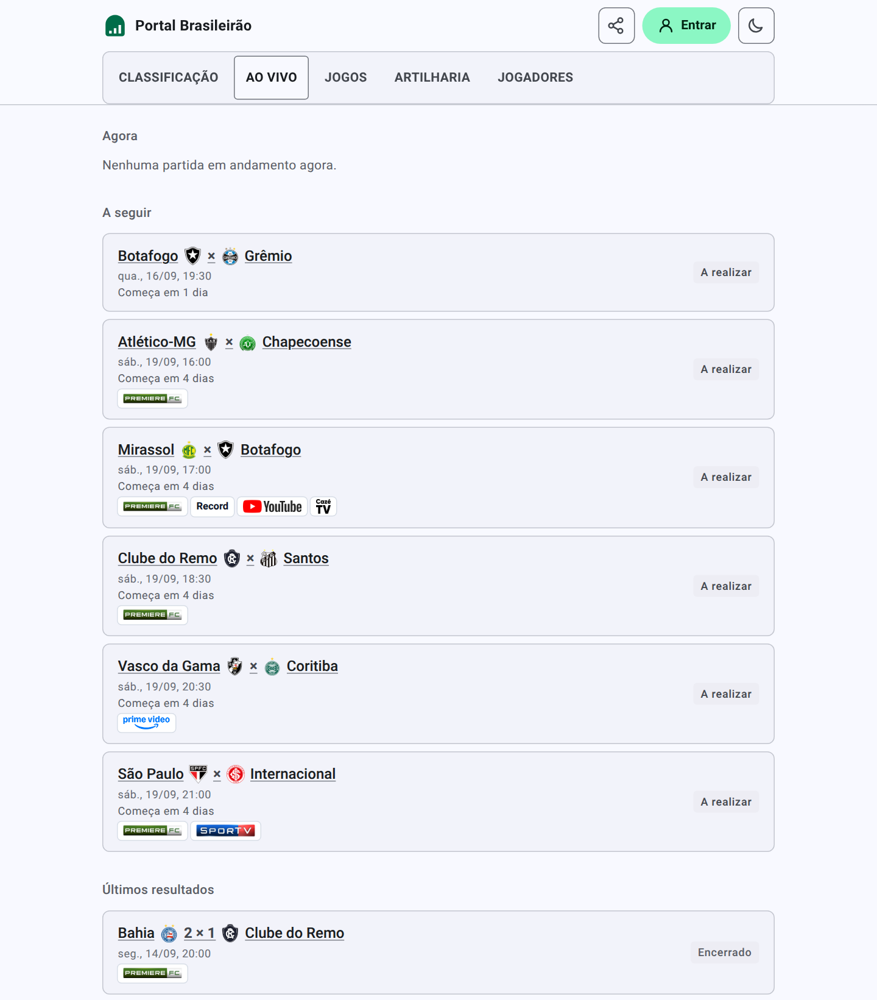
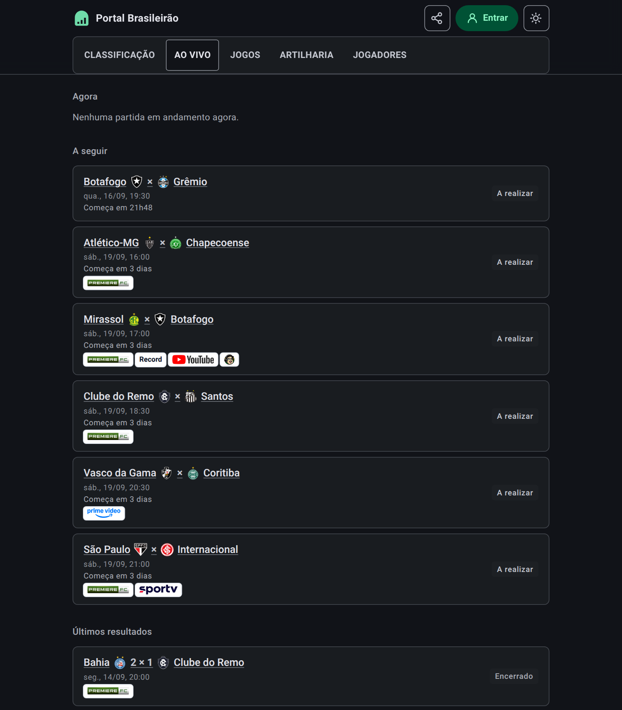
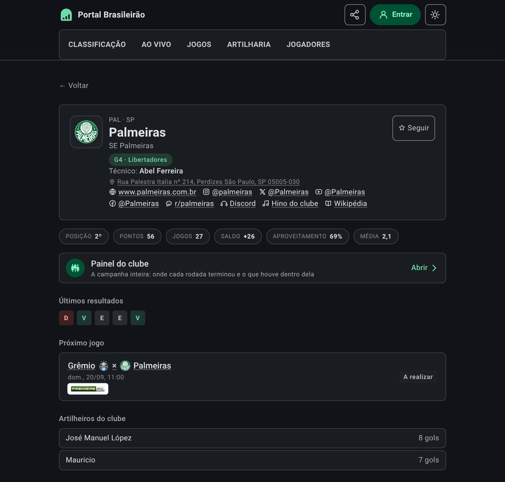
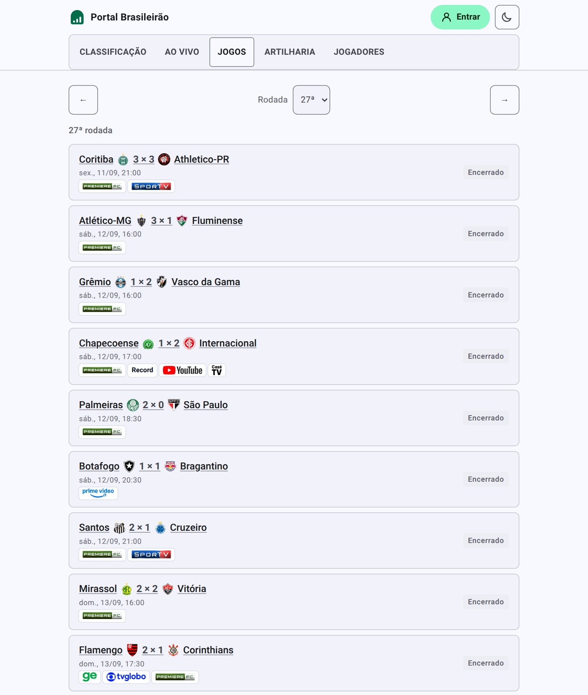
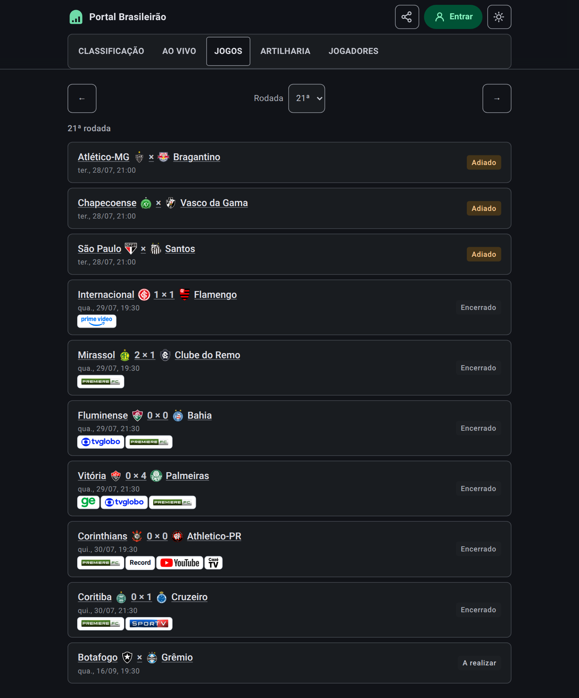
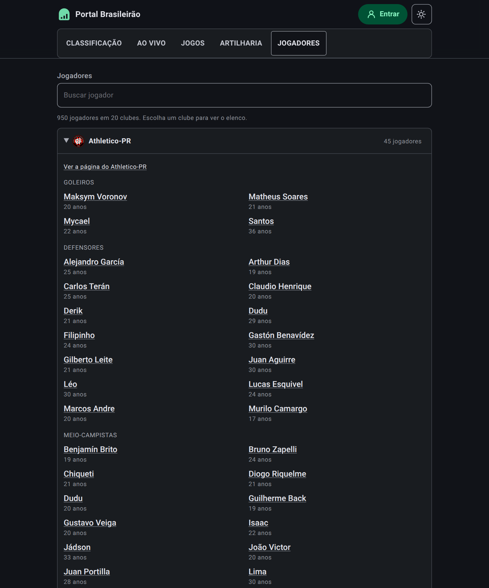

# Portal Brasileirão

[](https://github.com/mpbarbosa/portal_brasileirao/actions/workflows/ci.yml)

Companion app for the Brazilian football championship — live match detail, standings, and
club data for the Campeonato Brasileiro Série A.

**React 19 · TypeScript · Express · AWS.** Built end-to-end by directing the AI coding
agent Claude Code.

> **Live:** https://brasileirao.mpbarbosa.com — a t3.micro in sa-east-1 running the bundle as a
> systemd service behind nginx, on a static Elastic IP, with an auto-renewing Let's
> Encrypt certificate.
>
> Live Série A data comes from [football-data.org](https://www.football-data.org) when
> `FOOTBALL_DATA_TOKEN` is set; without a token the app serves a frozen snapshot, so a
> fresh clone runs with no signup.




*Classificação, light and dark. The app follows your system setting and remembers an explicit
choice; the control in the header switches between them. **Campanha** is the club's position
after each round — the season behind a single row.*

 

*On a phone the five sections move to a navigation bar fixed at the bottom, icon above label,
the current one marked by a pill. Above `sm` they stay inline in the header — which is why the
desktop shots above look no different. Five is Material Design 3's ceiling for this pattern, and
the bar is now at it: the labels fit at 375dp because the items carry no horizontal padding, and
below 360dp the active indicator narrows rather than let the last destination fall off the edge.*





*Ao vivo, light and dark — what is being played now, what is next, and what just finished.
Matches in progress get a card each rather than a row, so simultaneous kickoffs are all
visible at once; the shots above were taken between rounds, which is the honest common case
and why "Agora" answers in a sentence instead of vanishing. It is the only page that
refetches on its own. There is deliberately no match minute: the provider reports a status
and a score and never an elapsed clock, so the page says **bola rolando** rather than
guessing a number.*








*Jogos, light and dark. Every round of the season is reachable from the picker, and each
fixture carries the broadcasters showing it — ge, Globo, Premiere, SporTV, Cazé TV, YouTube
and Prime Video, with anyone we have no mark for rendered as their own name.*




*Jogadores, light and dark — the elenco of all twenty clubs. The panels are native `<details>`,
closed on arrival: the division fields close to a thousand players, and rendered flat the second
club would begin twenty screens below the first, which is exactly the by-club structure the page
exists to show. Two clubs can be open at once, which a picker would not allow. Positions arrive
from the provider at two levels of detail in the same list — a broad line for most players, a
specific role for a few — so they are folded onto the line they belong to, and a player's own
position is printed under the name only when it says something the heading did not.*


*A match page, light and dark. Both clubs' campanhas are stacked rather than overlaid, so
they share one scale and their rounds line up — the app has no series palette, and inventing
a hue pair would be the only place colour carried meaning no token defines. **Melhores
momentos** links each broadcaster's own package; where none is curated it falls back to a
YouTube search and says so.*

*A club page, in both themes. **Campanha** traces where the club sat after every round, and
the marks under each fixture say which broadcaster showed it. The marks keep a light backing
in both themes on purpose — Globo's circle and the Premiere wordmark are dark artwork on a
transparent ground, and they vanish against a dark page without it.*

![Página do estádio Maracanã no tema claro: o nome popular em destaque, "Rio de Janeiro – RJ" abaixo, o nome oficial "Estádio Jornalista Mário Filho" e uma ligação para o artigo na Wikipédia; uma fotografia aérea do estádio ao entardecer, iluminado, com a cidade e os morros do Rio ao fundo, e logo abaixo a linha de crédito com o nome do fotógrafo e a licença; dois números lado a lado — capacidade de 78.838 e inaugurado em 1950; os mandantes Fluminense e Flamengo, cada um com escudo e ligação para a sua página; e os jogos disputados no estádio, cada um com placar ou horário, as emissoras e a situação.](docs/screenshots/estadio-maracana-light.png)


*A stadium page, light and dark, reached from a match's **Estádio** line — it has no nav
entry, because a ground is somewhere you arrive at from a fixture rather than a section
you set out to browse. No feed we read has a stadium in it:
football-data carries no venue field at any tier, and CBF reports only `Stadium - City - UF`
per match, so the roster is derived by grouping fixtures on the slug of that string. That
slug is the identity, which is what makes CBF's `ARENA MRV` and `Arena MRV` one ground
rather than two. **Mandantes** falls out of who actually hosted there — nobody had to say
the Maracanã has two tenants. Capacity, the official name and the year are hand-curated, and
each is left out rather than guessed where the source is silent. So is the
**photograph**, which no feed carries either — it is named by its file title on
Wikimedia Commons and fetched from there, and it always ships with the photographer
and the licence, because every licence in use but one requires the credit wherever
the picture appears.*

## Stack

| Layer | Choice |
| --- | --- |
| UI | React 19 + TypeScript, Vite dev server and build |
| Styling | Tailwind CSS |
| API / SSR host | Express (TypeScript, bundled with esbuild for production) |
| Data | [football-data.org](https://www.football-data.org) v4, competition `BSA` |
| Hosting | AWS |
| Tests | `node --test` for unit logic, Playwright for end-to-end |

The Express server owns the data-sync layer (fetching and normalizing match, table, and
club data) and serves the built React bundle, so development and production run the same
single process.

## Local setup

1. Install dependencies:

```sh
npm install
```

2. Copy `.env.example` to `.env`. For live data, register a free token at
   [football-data.org](https://www.football-data.org/client/register) and set
   `FOOTBALL_DATA_TOKEN`. Skip it to run on seed fixtures.

3. Start the development server:

```sh
npm run dev
```

The dev server listens on port `3000`, or the next free port if `3000` is taken.

## Commands

- `npm run dev` — start the Express + Vite development server
- `npm run build` — build the frontend and bundle the server
- `npm start` — run the production build
- `npm run lint` — type-check with TypeScript
- `npm run test:unit` — run the Node unit test suite
- `npm run test:e2e` — run the Playwright end-to-end suite (boots its own server)
- `npm run clean` — remove `dist`
- `npx tsx scripts/sync-seed-data.ts` — regenerate the offline seed data from the live API
- `npm run screenshot [url] [light|dark]` — refresh the README screenshot from the live site
- `npm run deploy:preflight` — build and verify the production payload locally
- `DEPLOY_HOST=ubuntu@host npm run deploy` — deploy to EC2 (see `scripts/README.md`)

Run a single test file with `node --import tsx --test tests/standings-core.test.ts`.

## Layout

```
src/                    React application, shared types, seed data
standings-core.ts       pure table computation (no I/O)
matches-core.ts         pure round filtering and feed ordering (no I/O)
football-data-core.ts   pure football-data.org adapter: URLs + response mapping
cache-core.ts           TTL cache and circuit breaker
server.ts               Express host: API routes, Vite in dev, static serving in prod
tests/                  unit tests for the core modules
```

Calculation logic lives in root-level `*-core.ts` modules that do no I/O, so it can be
unit-tested without mocking HTTP. `server.ts` does any fetching and passes payloads in.

## API

Every data endpoint returns `{ source, note, updatedAt, data }`, where `source` is one of:

- `football-data` — live upstream data
- `placeholder` — seed fixtures, because no token is configured
- `fallback` — seed fixtures, because the upstream failed or was disabled

The UI banners the `note` for anything that isn't live. The free tier allows 10
requests/minute; standings cache for 60s and fixtures for 60s (15s while a match is live),
so the app makes at most ~5 upstream calls/minute no matter how much traffic it serves. A
circuit breaker opens after 3 consecutive failures and stays open for 60s.

- `GET /api/health` — status, version, uptime
- `GET /api/clubs` — the 20 Série A clubs
- `GET /api/standings` — the computed table
- `GET /api/matches[?round=N]` — fixtures, defaulting to the whole feed

## Working with Claude Code

This repository is developed by directing Claude Code rather than by hand.
[CLAUDE.md](CLAUDE.md) carries the architecture and conventions;
[CONTEXT.md](CONTEXT.md) is the domain glossary — what each Portuguese term means in
this codebase, and which near-synonyms were rejected and why. Read both before changing
behaviour, and update them in the same commit when a convention or a term changes.

## License

MIT — see [LICENSE](LICENSE).
