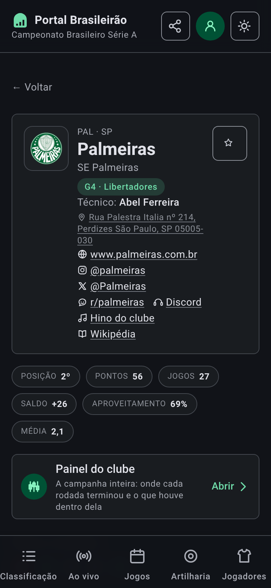
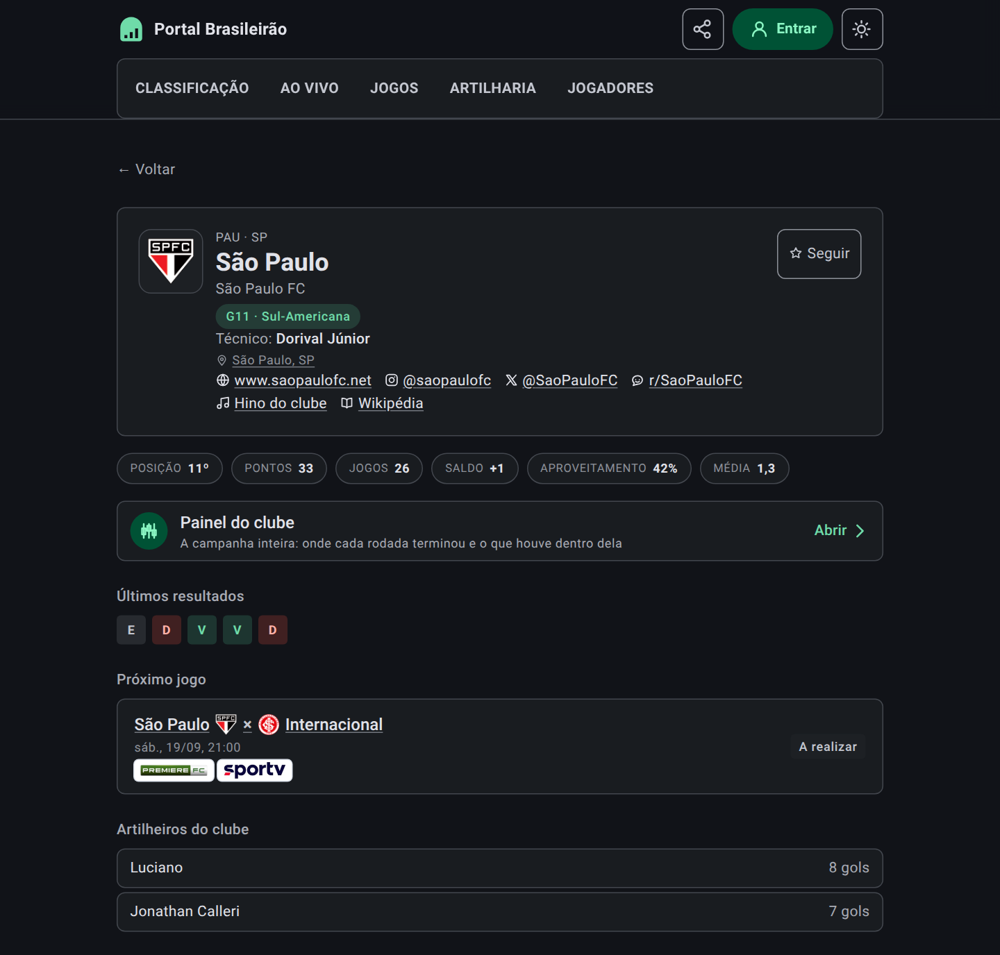
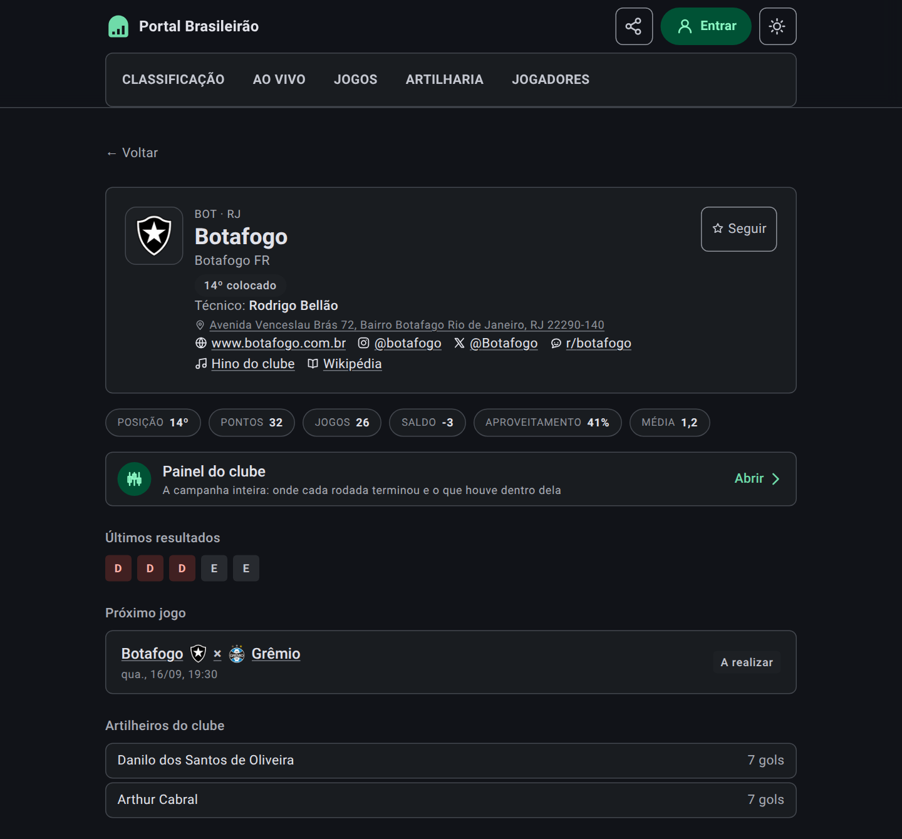
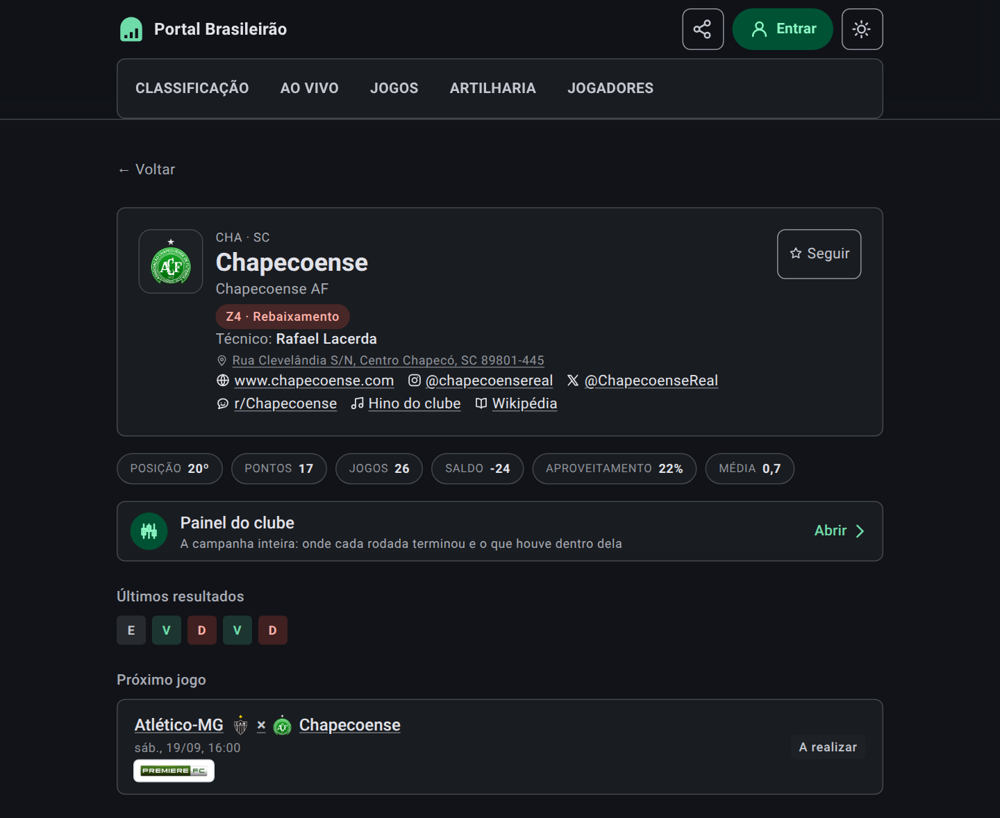

# Portal Brasileirão

[](https://github.com/mpbarbosa/portal_brasileirao/actions/workflows/ci.yml)

Companion app for the Brazilian football championship — live match detail, standings, and
club data for the Campeonato Brasileiro Série A.

**React 19 · TypeScript · Express · AWS.** Built end-to-end by directing the AI coding
agent Claude Code.

> **Live:** https://brasileirao.mpbarbosa.com — a t3.micro in sa-east-1 running the bundle as a
> systemd service behind nginx, on a static Elastic IP, with an auto-renewing Let's
> Encrypt certificate.
>
> Live Série A data comes from [football-data.org](https://www.football-data.org) when
> `FOOTBALL_DATA_TOKEN` is set; without a token the app serves a frozen snapshot, so a
> fresh clone runs with no signup.

![Classificação do Campeonato Brasileiro Série A no tema claro: no alto, à esquerda, a marca do site — um arco cheio com três barras a subir vazadas nele — ao lado do nome Portal Brasileirão; à direita, o botão de compartilhar — três pontos ligados por dois traços —, o botão Entrar e o que alterna entre o tema claro e o escuro. Numa linha própria sob ele, as secções Classificação, Ao vivo, Jogos, Artilharia e Jogadores, a atual sublinhada. Acima da tabela, à esquerda, um seletor de três posições — Completa, Casa e Fora, com Completa marcada; à direita, dois botões: um mostra a forma na coluna da campanha, o outro oferece ver a campanha em barras em vez da linha. Abaixo, os 20 clubes com escudo, pontos, o gráfico da campanha, jogos, vitórias, empates, derrotas, saldo de gols e o aproveitamento em percentagem; a posição do líder vem num círculo cheio, e só a dele. À direita de cada posição, uma marca diz como o clube se moveu desde a rodada anterior — verde a apontar para cima, vermelha para baixo e um traço cinzento para quem manteve o lugar: aqui a 27ª rodada já foi toda jogada, então há de tudo — Bahia, Atlético-MG, Santos e Mirassol sobem, Fluminense, Coritiba, São Paulo, Vitória, Corinthians e Grêmio descem, e os restantes mantêm o lugar. À esquerda de cada posição, uma faixa diz o que aquela posição vale: verde contínua nos quatro primeiros, verde tracejada no quinto, azul-escura do sexto ao décimo primeiro e vermelha nos quatro últimos, com o meio da tabela sem faixa nenhuma. Sobre a parte baixa da tabela, na altura do Vasco da Gama e do Internacional, flutua um botão redondo com uma seta para baixo, que avisa que a página continua abaixo da dobra. Logo abaixo, uma legenda de quatro linhas diz o que cada faixa significa: G4 Libertadores, as quatro primeiras posições; G5 Pré-Libertadores, a quinta posição; G11 Sul-Americana, da sexta à décima primeira posição; e Z4 Rebaixamento, as quatro últimas. Sob a legenda, o painel Números da temporada: em três cartões, os gols do campeonato e em quantos jogos, os gols por jogo e a percentagem de vitórias do mandante; e ao lado um do outro, os melhores ataques e as melhores defesas, três clubes em cada, com escudo, nome e o número de gols. Sob esse painel, Curiosidades da campanha, em cinco cartões que leem a campanha inteira em vez da tabela de hoje: a maior queda, 18 posições, do 2º ao 20º, do Chapecoense; a maior subida, 14 posições, empatada entre Cruzeiro e Flamengo; a campanha mais estável, 3 posições, do Fluminense, entre o 3º e o 6º; mais rodadas na ponta, 19, do Palmeiras, que hoje é 2º; e mais empates, 10, de Bahia e Internacional. Os dois primeiros trazem a ressalva de que incluem as rodadas 1 e 2, em que clubes sem jogos são ordenados por nome. Ao pé da página, o rodapé diz que o projeto é independente e sem vínculo com a CBF ou com os clubes, traz duas ligações para os outros sites do autor — mpbarbosa.com e copa2026.mpbarbosa.com — e a saúde do serviço: estado, fonte dos dados, versão, quando foi compilado e desde quando está no ar.](docs/screenshots/classificacao-light.png)


*Classificação, light and dark. The app follows your system setting and remembers an explicit
choice; the control in the header switches between them. **Campanha** is the club's position
after each round — the season behind a single row.*

 

*On a phone the five sections move to a navigation bar fixed at the bottom, icon above label,
the current one marked by a pill. Above `sm` they stay inline in the header — which is why the
desktop shots above look no different. Five is Material Design 3's ceiling for this pattern, and
the bar is now at it: the labels fit at 375dp because the items carry no horizontal padding, and
below 360dp the active indicator narrows rather than let the last destination fall off the edge.*

![Página Ao vivo no tema claro, sem nenhum jogo em andamento: a secção Agora diz “Nenhuma partida em andamento agora.” — o estado normal fora das tardes de rodada, e o que a página mostra quando não há bola rolando. Depois, A seguir lista seis jogos, cada um com o nome de um clube, os dois escudos encostados ao × no meio e o nome do outro, a data, o horário, a contagem regressiva e a etiqueta A realizar: Botafogo × Grêmio, quarta 16/09 às 19:30, Começa em 1 dia — o jogo remarcado da 21ª rodada, e o único dos seis sem marca de emissora; e, todos de sábado 19/09, Atlético-MG × Chapecoense às 16:00, Mirassol × Botafogo às 17:00, Clube do Remo × Santos às 18:30, Vasco da Gama × Coritiba às 20:30 e São Paulo × Internacional às 21:00 — os dois primeiros com Começa em 3 dias e os outros três com Começa em 4 dias. O Premiere FC está em quatro desses cinco, com Record, YouTube e CazéTV a acompanhá-lo em Mirassol × Botafogo e o SporTV em São Paulo × Internacional; o prime video vem sozinho em Vasco da Gama × Coritiba. Abaixo, Últimos resultados abre com Bahia 2 × 1 Clube do Remo, segunda 14/09 às 20:00, Encerrado, com a marca do Premiere FC, onde o enquadramento acaba](docs/screenshots/ao-vivo-light.png)


*Ao vivo, light and dark — what is being played now, what is next, and what just finished.
Matches in progress get a card each rather than a row, so simultaneous kickoffs are all
visible at once. These shots caught none being played, which is the ordinary state:
between rounds "Agora" answers in a sentence rather than vanishing, which is the more common
state and the reason it is written as a sentence at all. It is the only page that
refetches on its own. There is deliberately no match minute: the provider reports a status
and a score and never an elapsed clock, so the page says **bola rolando** rather than
guessing a number.*

![Página do clube Palmeiras no tema claro: um cartão reúne o escudo numa moldura, a legenda “PAL · SP” em versalete, o nome Palmeiras em destaque, o nome “SE Palmeiras” logo abaixo, uma etiqueta verde “G4 · Libertadores”, o técnico Abel Ferreira, o endereço da sede — com um alfinete, que abre o endereço no mapa —, e a fila de links: site oficial, perfil no Instagram, o X oficial @Palmeiras, o subreddit r/palmeiras, o Discord da torcida, hino do clube e artigo na Wikipédia; à direita do cartão, o botão Seguir, que marca o clube como o time do leitor. Abaixo do cartão, os números da temporada em cápsulas soltas — Posição 2º, Pontos 56, Jogos 27, Saldo +26, Aproveitamento 69%, Média 2,1 — a média de pontos por partida, que é o aproveitamento na unidade em que o futebol costuma ser falado —; logo abaixo, uma faixa Painel do clube, “A campanha inteira: onde cada rodada terminou e o que houve dentro dela”, que leva a essa página — a própria campanha não é desenhada aqui, mudou-se para o painel; os últimos cinco resultados, o próximo jogo — Grêmio × Palmeiras, com os dois escudos encostados ao × entre os nomes, domingo 20/09 às 11:00, marcado como A realizar, com a marca do Premiere FC —, e os artilheiros do clube, José Manuel López com 8 gols e Mauricio com 7, onde o recorte acaba. Os Vídeos do clube — cada vídeo na largura da coluna, do tamanho dos Melhores momentos da página de partida —, os Acontecimentos — o que houve fora de campo, com a paralisação para a Copa do Mundo — e os Jogos disputados ficam abaixo do recorte](docs/screenshots/clube-palmeiras-light.png)

![A mesma página do clube Palmeiras no tema escuro: o mesmo cartão com o escudo emoldurado, a legenda “PAL · SP”, o nome, a etiqueta “G4 · Libertadores”, o técnico, o endereço da sede com o seu alfinete, a mesma fila de links e o mesmo botão Seguir; as mesmas cápsulas de Posição, Pontos, Jogos, Saldo, Aproveitamento e Média abaixo do cartão; a mesma faixa do Painel do clube, igualmente sem gráfico da campanha acima dela; os mesmos últimos resultados, o mesmo próximo jogo e os mesmos artilheiros, com o recorte acabando no mesmo lugar, acima dos Vídeos do clube; o mesmo X, o mesmo subreddit e o mesmo Discord na fila de links](docs/screenshots/clube-palmeiras-dark.png)

 

*On a phone the header card's link row wraps to its own lines and the five season figures
split across two rows of pills instead of one — the frame ends at the Painel do clube band, well
above where the desktop crop reaches Artilheiros. It ended at Últimos resultados until the X
handle gave the link row one more line.*

The header card's zone pill reads differently depending on where a club sits: green and
naming the continental spot for a club inside the top eleven, grey and naming only the bare
position for a club in the middle of the table, red and naming the rebaixamento for a club
in the bottom four. Three more clubs, one per state:

![Página do clube São Paulo no tema claro: o cartão traz o escudo emoldurado, a legenda “PAU · SP”, o nome São Paulo em destaque, “São Paulo FC” logo abaixo, uma etiqueta verde “G11 · Sul-Americana”, o técnico Dorival Júnior, o endereço da sede com o seu alfinete, e a fila de links — site oficial, Instagram, o X @SaoPauloFC, o subreddit r/SaoPauloFC, hino do clube e Wikipédia, sem Discord da torcida — e o botão Seguir à direita. Abaixo, as cápsulas Posição 11º, Pontos 33, Jogos 26, Saldo +1, Aproveitamento 42%, Média 1,3; a faixa Painel do clube; os últimos cinco resultados E D V V D; o próximo jogo São Paulo × Internacional, sábado 19/09 às 21:00, A realizar; e os artilheiros do clube, Luciano com 8 gols e Jonathan Calleri com 7, onde o recorte acaba](docs/screenshots/clube-sao-paulo-light.png)



![Página do clube Botafogo no tema claro: o cartão traz o escudo emoldurado, a legenda “BOT · RJ”, o nome Botafogo em destaque, “Botafogo FR” logo abaixo, uma etiqueta cinza neutra “14º colocado” — sem zona, porque a posição não cai em nenhuma faixa de classificação continental ou de rebaixamento —, o técnico Rodrigo Bellão, o endereço da sede com o seu alfinete, e a fila de links — site oficial, Instagram, o X @Botafogo, o subreddit r/botafogo, hino do clube e Wikipédia — e o botão Seguir à direita. Abaixo, as cápsulas Posição 14º, Pontos 32, Jogos 26, Saldo -3, Aproveitamento 41%, Média 1,2; a faixa Painel do clube; os últimos cinco resultados D D D E E; o próximo jogo Botafogo × Grêmio, quarta 16/09 às 19:30, A realizar; e os artilheiros do clube, Danilo dos Santos de Oliveira e Arthur Cabral, ambos com 7 gols, onde o recorte acaba](docs/screenshots/clube-botafogo-light.png)



![Página do clube Chapecoense no tema claro: o cartão traz o escudo emoldurado, a legenda “CHA · SC”, o nome Chapecoense em destaque, “Chapecoense AF” logo abaixo, uma etiqueta vermelha “Z4 · Rebaixamento”, o técnico Rafael Lacerda, o endereço da sede com o seu alfinete, e a fila de links — site oficial, Instagram, o X @ChapecoenseReal, o subreddit r/Chapecoense, hino do clube e Wikipédia — e o botão Seguir à direita. Abaixo, as cápsulas Posição 20º, Pontos 17, Jogos 26, Saldo -24, Aproveitamento 22%, Média 0,7 — 17 pontos em 26 jogos, e não nas 27 rodadas já disputadas, que é a distinção que essa cápsula carrega; a faixa Painel do clube; os últimos cinco resultados E V D V D; e o próximo jogo Atlético-MG × Chapecoense, sábado 19/09 às 16:00, A realizar, onde o recorte acaba — mais cedo que nos outros dois, porque o cartão não teve artilheiros a mostrar dentro dos mesmos 1080px](docs/screenshots/clube-chapecoense-light.png)



![Página de jogos no tema claro: o seletor de rodada na 21ª — a rodada mais antiga que ainda tem jogo por disputar, e por isso a que a página abre, embora a 27ª já esteja toda jogada — com a rodada inteira no enquadramento. Dez jogos: primeiro os três adiados, Atlético-MG × Bragantino, Chapecoense × Vasco da Gama e São Paulo × Santos, com a data original de terça 28/07 às 21:00 e a etiqueta amarela Adiado; depois os seis encerrados, Internacional 1 × 1 Flamengo e Mirassol 2 × 1 Clube do Remo às 19:30 de quarta 29/07, Fluminense 0 × 0 Bahia e Vitória 0 × 4 Palmeiras às 21:30 do mesmo dia, e Corinthians 0 × 0 Athletico-PR e Coritiba 0 × 1 Cruzeiro às 19:30 e às 21:30 de quinta 30/07; e por fim Botafogo × Grêmio, remarcado para quarta 16/09 às 19:30, com a etiqueta A realizar, onde o enquadramento acaba. Cada linha traz no título o nome de um clube, os dois escudos encostados ao placar — ou ao ×, nos que não se jogaram — e o nome do outro, a data e o horário, e as marcas das emissoras que transmitiram](docs/screenshots/jogos-light.png)


*Jogos, light and dark. Every round of the season is reachable from the picker, and each
fixture carries the broadcasters showing it — ge, Globo, Premiere, SporTV, Cazé TV, YouTube
and Prime Video, with anyone we have no mark for rendered as their own name.*


*Jogadores, light and dark — the elenco of all twenty clubs. The panels are native `<details>`,
closed on arrival: the division fields close to a thousand players, and rendered flat the second
club would begin twenty screens below the first, which is exactly the by-club structure the page
exists to show. Two clubs can be open at once, which a picker would not allow. Positions arrive
from the provider at two levels of detail in the same list — a broad line for most players, a
specific role for a few — so they are folded onto the line they belong to, and a player's own
position is printed under the name only when it says something the heading did not.*

![Página da partida Palmeiras 4 x 1 Vasco da Gama no tema claro, no estilo do placar adotado depois: a 24ª rodada e a etiqueta Encerrado centralizadas uma sobre a outra, os escudos dos dois clubes em azulejos de borda arredondada, e o placar "4 × 1" bem maior dentro de uma bandeja também maior, com o horário do jogo — "Domingo, 23 de agosto de 2026 às 16:00" — logo abaixo dele, um dado que o recorte antigo desta mesma imagem nunca chegava a mostrar; sob o nome de cada clube, uma ligação para o seu artigo na Wikipédia; sob uma linha divisória, quem marcou de cada lado e em que minuto — Lopez aos 46', Vitor Roque de pênalti aos 50', Mauricio aos 55' e Lopez aos 89' pelo Palmeiras, Facundo aos 90+3' pelo Vasco — os quatro nomes do Palmeiras sublinhados, porque abrem o cartão do jogador, e o do Vasco em texto simples, porque o elenco congelado não o resolve; e os melhores momentos, que são o próprio vídeo: o quadro do player do YouTube ocupando a largura da página, com a capa do pacote da ge tv — "PALMEIRAS 4 X 1 VASCO | MELHORES MOMENTOS | 24ª RODADA" — e o botão vermelho de play ao centro, nada tocando por si; sob ele, "Melhores momentos por ge tv. Se não tocar aqui, abra no YouTube." e, na linha seguinte, "Também por UOL Esporte", onde o enquadramento acaba, como antes — a Data e hora, o Estádio e as emissoras continuam abaixo do recorte, junto das Escalações e da Campanha dos dois clubes](docs/screenshots/partida-554977-light.png)


*A match page, light and dark. **Gols** names who scored and for which club, from CBF's own
match feed — the club a goal *counts for* rather than the scorer's club, which is the whole of
what puts an own goal on the right side of a scoreboard. It is also what pushed the Escalações
and the Campanha below this capture's crop — melhores momentos itself stays inside it — and
goal coverage has since reached the second fixture too, where the Escalações and Campanha fall
outside its own crop the same way. Neither capture shows either of the two.
Both clubs' campanhas are stacked rather than overlaid, so
they share one scale and their rounds line up — the app has no series palette, and inventing
a hue pair would be the only place colour carried meaning no token defines. **Melhores
momentos** *plays* the preferred package in the page, with the other broadcasters as links
under it that swap the frame; where none is curated it falls back to a YouTube search and
says so. It is also what pushed the Escalações out of both fixture captures: the player is
taller than the row of channel marks it replaced.*

![Página da partida Botafogo 1 x 1 Fluminense no tema claro, no estilo do placar adotado depois: a 22ª rodada e a etiqueta Encerrado centralizadas uma sobre a outra, os escudos dos dois clubes em azulejos de borda arredondada, e o placar "1 × 1" bem maior dentro de uma bandeja também maior, com o horário do jogo — "Sábado, 08 de agosto de 2026 às 21:00" — logo abaixo dele; sob o nome de cada clube, uma ligação para o seu artigo na Wikipédia; sob uma linha divisória, quem marcou de cada lado e quando — Alex Telles, de falta, aos 43' pelo Botafogo, e Ignacio aos 58' pelo Fluminense, ambos sublinhados porque abrem o cartão do jogador; os melhores momentos, que são o próprio vídeo: o quadro do player do YouTube com a capa do pacote da ge tv — "BOTAFOGO 1 X 1 FLUMINENSE | MELHORES MOMENTOS | 22ª RODADA" — e o botão vermelho de play ao centro, nada tocando por si; sob ele, "Melhores momentos por ge tv. Se não tocar aqui, abra no YouTube." e, na linha seguinte, "Também por CazéTV · UOL Esporte", onde o enquadramento agora acaba: o cabeçalho e o horário maiores empurraram o Estádio, o Árbitro e as emissoras que transmitiram para baixo do recorte, junto das Escalações e da Campanha dos dois clubes, que já estavam lá](docs/screenshots/partida-554951-light.png)


*A second match page. Where the Palmeiras capture shows four goals with a pênalti mark, this
one shows a foul-won free kick marked "(falta)" and one scorer a side — the two shapes
`goalLabel` prints. It no longer reaches the Estádio, Árbitro or Onde assistir sections either:
the taller centred header and the kickoff line under the score push the crop to end at the same
"Melhores momentos" band as the capture above, for the same reason. It was chosen, before that
header grew, for a fixture upstream names a referee on and the curated venue and broadcast pair
does not overlap with — 157 of the season's 380 fixtures carry a referee, 30 carry curated
venue and broadcast data for coming rounds, and no round sits in both sets.*

*A club page, in both themes. The **Painel do clube** row opens the club's campanha —
the line tracing where it sat after every round, and beneath it a candle per rodada — and
the marks under each fixture say which broadcaster showed it. The campanha is not drawn
here: moving it let **Jogos disputados** into the frame, which is what these two images
now reach.* The marks keep a light backing
in both themes on purpose — Globo's circle and the Premiere wordmark are dark artwork on a
transparent ground, and they vanish against a dark page without it.*

![Painel do clube Palmeiras no tema claro: o escudo ao lado do título “Painel do Palmeiras” e, sob ele, “A campanha inteira, rodada a rodada”; quatro números — 2º de posição, 56 pontos, 27 rodadas e uma média de 2,1 pontos por partida, esta última dividindo os pontos pelas partidas jogadas e não pelas rodadas passadas; a Campanha, com um botão que a troca de linha para barras, desenhada do 11º lugar na 1ª rodada ao 2º na 27ª; e, abaixo, a mesma campanha rodada a rodada em velas, com um seletor “Comparar com” à direita do título — em Nenhum, que é como a página abre — que desenha as velas de um segundo clube por baixo destas, no mesmo quadro. Cada vela vai da posição em que a rodada começou à do fim dela, verde para vitória, cinzenta para empate e vermelha para derrota, com a linha fina do pavio atravessando as posições ocupadas enquanto a rodada era disputada e duas linhas tracejadas marcando o G4 e o Z4; uma régua vertical tracejada cai na fronteira depois da 18ª rodada e é nomeada logo abaixo do desenho — “após a 18ª rodada · Brasileirão paralisado para a Copa do Mundo (1 de junho de 2026)”, onde o recorte acaba. A legenda das quatro cores — Vitória, Empate, Derrota e Sem jogo —, os dois parágrafos que explicam o corpo, o traço e o pavio, e as secções Destaques e Perfil ficam abaixo do recorte: a quarta cápsula e a fila de separadores acima empurraram-nos para fora dos 1080px](docs/screenshots/painel-palmeiras-light.png)


*The **Painel do clube**, in both themes — the page that row opens. The line at the top is
the campanha as the Classificação draws it; the velas beneath read the same rounds one
grain finer, because a round is one point on the line and a club can lose four places
inside it. Colour carries the result and the geometry carries the direction, and the rounds
worth looking at are the ones where they disagree. **Destaques and Perfil sit below the
frame**: a capture is cropped at the last section fitting in 1080 CSS px, and the velas take
most of it.*


![Página do estádio Maracanã no tema claro: o nome popular em destaque, "Rio de Janeiro – RJ" abaixo, o nome oficial "Estádio Jornalista Mário Filho" e uma ligação para o artigo na Wikipédia; uma fotografia aérea do estádio ao entardecer, iluminado, com a cidade e os morros do Rio ao fundo, e logo abaixo a linha de crédito com o nome do fotógrafo e a licença; dois números lado a lado — capacidade de 78.838 e inaugurado em 1950; os mandantes Fluminense, Flamengo e Vasco da Gama, cada um com escudo e ligação para a sua página; e o clima no estádio, com um ícone de nuvem, 21 °C, “Nublado”, a sensação de 21 °C, a umidade de 78% e o vento de 20 km/h ao lado, e sob o cartão a hora da leitura — 14:29 — e a fonte, o Open-Meteo](docs/screenshots/estadio-maracana-light.png)


*A stadium page, light and dark, reached from a match's **Estádio** line — it has no nav
entry, because a ground is somewhere you arrive at from a fixture rather than a section
you set out to browse. No feed we read has a stadium in it:
football-data carries no venue field at any tier, and CBF reports only `Stadium - City - UF`
per match, so the roster is derived by grouping fixtures on the slug of that string. That
slug is the identity, which is what makes CBF's `ARENA MRV` and `Arena MRV` one ground
rather than two. **Mandantes** falls out of who actually hosted there — nobody had to say
the Maracanã has two tenants. Capacity, the official name and the year are hand-curated, and
each is left out rather than guessed where the source is silent. So is the
**photograph**, which no feed carries either — it is named by its file title on
Wikimedia Commons and fetched from there, and it always ships with the photographer
and the licence, because every licence in use but one requires the credit wherever
the picture appears.*

## Stack

| Layer | Choice |
| --- | --- |
| UI | React 19 + TypeScript, Vite dev server and build |
| Styling | Tailwind CSS |
| API / SSR host | Express (TypeScript, bundled with esbuild for production) |
| Data | [football-data.org](https://www.football-data.org) v4, competition `BSA` |
| Hosting | AWS |
| Tests | `node --test` for unit logic, Playwright for end-to-end |

The Express server owns the data-sync layer (fetching and normalizing match, table, and
club data) and serves the built React bundle, so development and production run the same
single process.

## Local setup

1. Install dependencies:

```sh
npm install
```

2. Copy `.env.example` to `.env`. For live data, register a free token at
   [football-data.org](https://www.football-data.org/client/register) and set
   `FOOTBALL_DATA_TOKEN`. Skip it to run on seed fixtures.

3. Start the development server:

```sh
npm run dev
```

The dev server listens on port `3000`, or the next free port if `3000` is taken.

## Commands

- `npm run dev` — start the Express + Vite development server
- `npm run build` — build the frontend and bundle the server
- `npm start` — run the production build
- `npm run lint` — type-check with TypeScript
- `npm run test:unit` — run the Node unit test suite
- `npm run test:e2e` — run the Playwright end-to-end suite (boots its own server)
- `npm run clean` — remove `dist`
- `npx tsx scripts/sync-seed-data.ts` — regenerate the offline seed data from the live API
- `npm run screenshot [url] [light|dark]` — refresh the README screenshot from the live site
- `npm run deploy:preflight` — build and verify the production payload locally
- `DEPLOY_HOST=ubuntu@host npm run deploy` — deploy to EC2 (see `scripts/README.md`)

Run a single test file with `node --import tsx --test tests/standings-core.test.ts`.

## Layout

```
src/                    React application, shared types, seed data
standings-core.ts       pure table computation (no I/O)
matches-core.ts         pure round filtering and feed ordering (no I/O)
football-data-core.ts   pure football-data.org adapter: URLs + response mapping
cache-core.ts           TTL cache: when a stored answer may be served
circuit-breaker-core.ts circuit breaker: when to stop asking a failing upstream
server.ts               Express host: API routes, Vite in dev, static serving in prod
tests/                  unit tests for the core modules
```

Calculation logic lives in root-level `*-core.ts` modules that do no I/O, so it can be
unit-tested without mocking HTTP. `server.ts` does any fetching and passes payloads in.

## API

Every data endpoint returns `{ source, note, updatedAt, data }`, where `source` is one of:

- `football-data` — live upstream data
- `placeholder` — seed fixtures, because no token is configured
- `fallback` — seed fixtures, because the upstream failed or was disabled

The UI banners the `note` for anything that isn't live. The free tier allows 10
requests/minute; standings cache for 60s and fixtures for 60s (15s while a match is live),
so the app makes at most ~5 upstream calls/minute no matter how much traffic it serves. A
circuit breaker opens after 3 consecutive failures and stays open for 60s.

- `GET /api/health` — status, version, uptime
- `GET /api/clubs` — the 20 Série A clubs
- `GET /api/standings` — the computed table
- `GET /api/matches[?round=N]` — fixtures, defaulting to the whole feed

## Working with Claude Code

This repository is developed by directing Claude Code rather than by hand.
[CLAUDE.md](CLAUDE.md) carries the architecture and conventions;
[CONTEXT.md](CONTEXT.md) is the domain glossary — what each Portuguese term means in
this codebase, and which near-synonyms were rejected and why. Read both before changing
behaviour, and update them in the same commit when a convention or a term changes.

## License

MIT — see [LICENSE](LICENSE).
